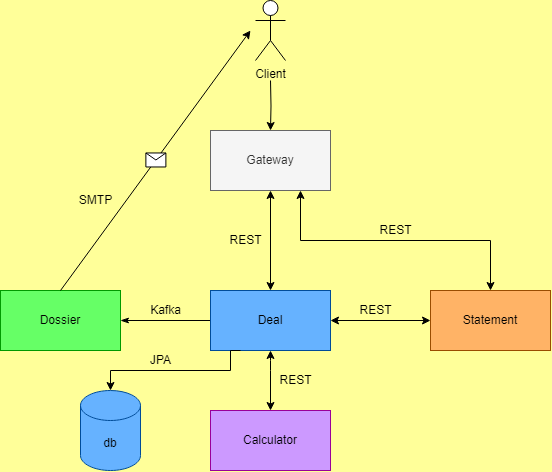

# Проектное задание: Java Development (весенний набор 2024)

На данном проекте учащийся сможет реализовать бэкенд-приложение с микросервисной архитектурой - прототип небольшого банка.

Реализуя проект учащийся приобретет знания и навыки, необходимые для любого современного бэкенд- разработчика:

- Разработка REST-API с использованием Spring Boot;

- Работа с базой данных, с использованием инструментов миграции;

- Знание микросервисной архитектуры;

- Синхронное и асинхронное взаимодействие сервисов через брокеры сообщений;

- Документирование API через Swagger/OpenAPI;

- Настройка CI-пайплайнов, контейнеризация приложения.

## Реализация



Разработано 5 микросервисов для решения поставленной задачи:

- calculator для расчета кредитов с аннуитентными выплатами(реализация также допускает и дифференциированные выплаты);
- deal для обработки входящих заявок и их хранения с базой данных, реализованных на postgres;
- statement - это сервис для проведения прескоринга входящих заявок;
- dossier для рассылки уведомлений, поддерживаются только отправки на email;
- gateway - это инфраструктурный сервис-фасад.

Для каждого сервиса реализованы соответствующие ветки с префиксом dev/ и ci пайплайны в них. Все образы хранятся в Docker Registry, Nexus не осмелился подключить,
потому что провайдер моего дома не предоставляет статический ip.

Применяемые технологии: Java 17, Spring boot 2.x(3.x-deal), Spring Boot Data JPA, Postgres, Liquibase, Maven, Spring Cloud(*OpenFeigh),
Spring Mail+Thymeleaf(для генерации писем), Nginx(реализован Gateway).

## Запуск
Для запуска перейти в корень проекта и запустить:

```
docker compose up -d
```
